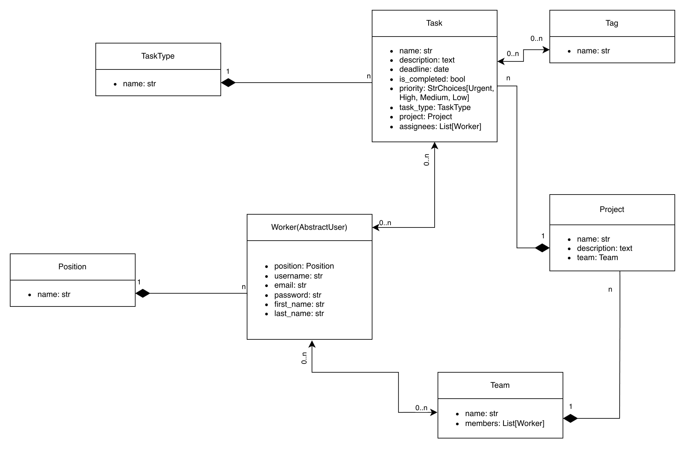
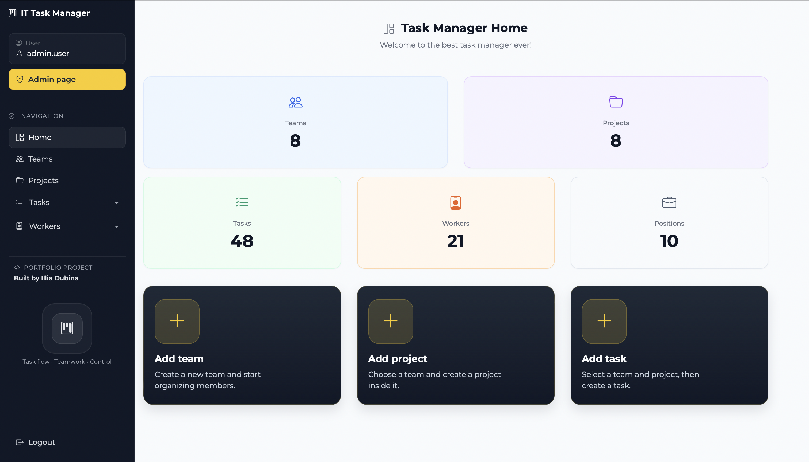
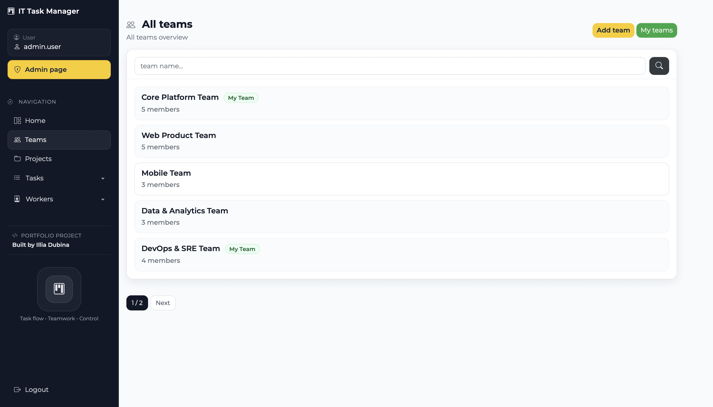
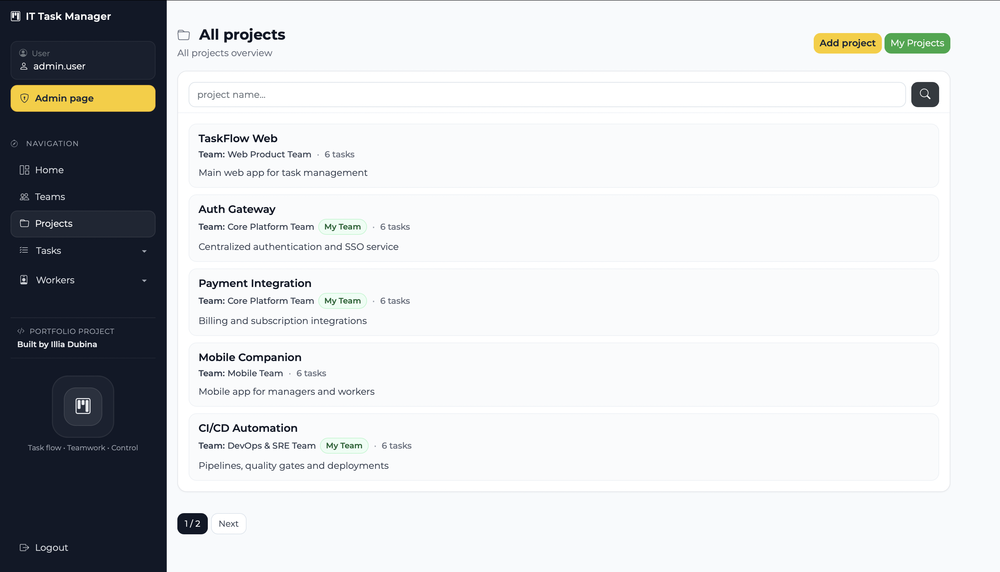
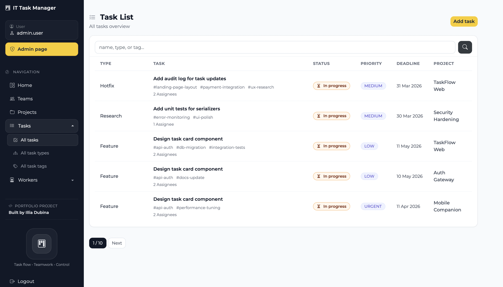
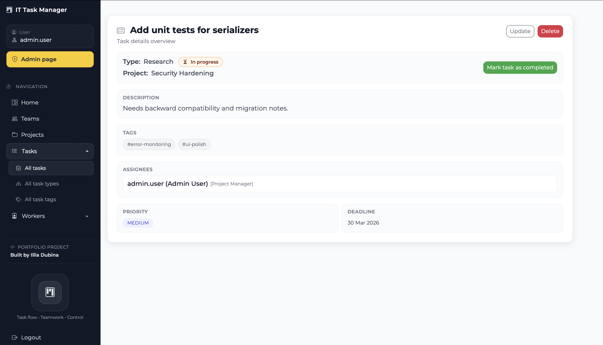
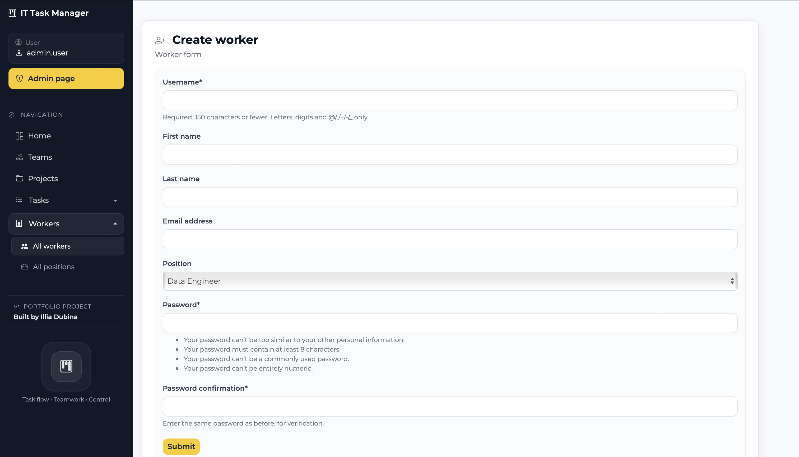

# IT Company Task Manager

Django portfolio project for managing development workflow in an IT company.

The application helps manage workers, teams, projects, and tasks, and includes access control, validation, search, pagination, and task assignment logic.

---

## Table of Contents

- [Overview](#overview)
- [Features](#features)
- [Business Logic](#business-logic)
- [Tech Stack](#tech-stack)
- [Database Schema](#database-schema)
- [Screenshots](#screenshots)
- [Setup and Run](#setup-and-run)
- [Load Fixture Data](#load-fixture-data)
- [Running Tests](#running-tests)
- [Admin Access](#admin-access)
- [Author](#author)


---

## Overview

This project was built as a Django portfolio application that simulates internal workflow management in an IT company.

It allows users to manage:

- workers and their positions
- teams and team members
- projects linked to specific teams
- tasks with assignees, priorities, deadlines, task types, and tags

The project also includes custom business rules to make the application closer to a real-world management system rather than a basic CRUD app.

---

## Features

- Custom user model: `Worker` (based on `AbstractUser`)
- Worker and position management
- Team management with assigned members
- Project management linked to specific teams
- Task management with:
  - name and description
  - deadline (`DateTime`)
  - completion status
  - priority (`Urgent`, `High`, `Medium`, `Low`)
  - task type (`TaskType`)
  - assignees (Many-to-Many with workers)
  - tags (Many-to-Many with `Tag`)
- Search across list pages
- Pagination for list views
- User-specific list pages such as **My teams** and **My projects**
- Visual markers for user-related teams and projects
- Staff-only access for selected management pages
- Multi-step creation flow for projects and tasks
- Django Admin support
- Custom 403 and 404 error pages
- Query optimization with `select_related`, `prefetch_related`, and `annotate`

---

## Business Logic

- Only team members can be assigned to tasks within their project
- Only allowed users can manage protected project and task data
- When a worker is removed from a team, they are removed from related task assignees
- A team must keep at least one member during update
- A task deadline cannot be set in the past
- Validation prevents invalid task assignments and inconsistent updates
- Search pages show clear empty-state messages when no results are found

---

## Tech Stack

- Python
- Django
- SQLite (default database)
- Django Admin
- Bootstrap 4
- Django Crispy Forms

---

## Database Schema



### Current model relationships (short)

- `Position` **1 : N** `Worker`
- `TaskType` **1 : N** `Task`
- `Team` **1 : N** `Project`
- `Project` **1 : N** `Task`
- `Worker` **M : N** `Task` (assignees)
- `Worker` **M : N** `Team` (members)
- `Task` **M : N** `Tag`

---

## Screenshots

### Dashboard
Main page with quick stats and navigation.



### Team List
Teams page with search, pagination, and **My Team** labels.



### Project List
Projects page with search, team info, and task counters.



### Task List
Tasks page with search, status, priority, deadlines, and pagination.



### Task Detail
Task details page with tags, assignees, priority, and status actions.



### Create Worker
Form page for creating a new worker.



---

## Setup and Run

### 1) Clone repository

```bash
git clone https://github.com/idubina/it-company-task-manager.git
cd it-company-task-manager
```

### 2) Environment variables

Create a `.env` file in the project root (next to `manage.py`) and add:

DJANGO_SECRET_KEY=your-secret-key

> `.env` is ignored by Git and should not be committed.

### 3) Create virtual environment

```bash
python -m venv venv
```

### 4) Activate virtual environment

**macOS / Linux**

```bash
source venv/bin/activate
```
**Windows (PowerShell)**

```powershell
venv\Scripts\Activate.ps1
```

**Windows (CMD)**

```bat
venv\Scripts\activate.bat
```

### 5) Install dependencies

```bash
pip install -r requirements.txt
```

### 6) Apply migrations

```bash
python manage.py migrate
```

### 7) Run development server

```bash
python manage.py runserver
```

By default, Django runs at:

- App: `http://127.0.0.1:8000/`
- Admin: `http://127.0.0.1:8000/admin/`

---

## Load Fixture Data

To load prepared test data:

```bash
python manage.py loaddata it_company_task_manager_db_data.json
```

This fixture can be used for quick local testing and project review.

---

## Running Tests

This project includes tests for core application behavior, including validations, permissions, and main views.

Run tests with:

```bash
python manage.py test
```

---

## Admin Access

After loading fixture data, you can use the following superuser:
  - Login: `admin.user`
  - Password: `1qazcde3`

> This account is for local demo purposes only.  
> Do not use these credentials in production.

Or create another superuser manually:

```bash
python manage.py createsuperuser
```
You can also add more test data through the Django admin panel if needed.

---

## Author

**Illia Dubina**

GitHub: [idubina](https://github.com/idubina)